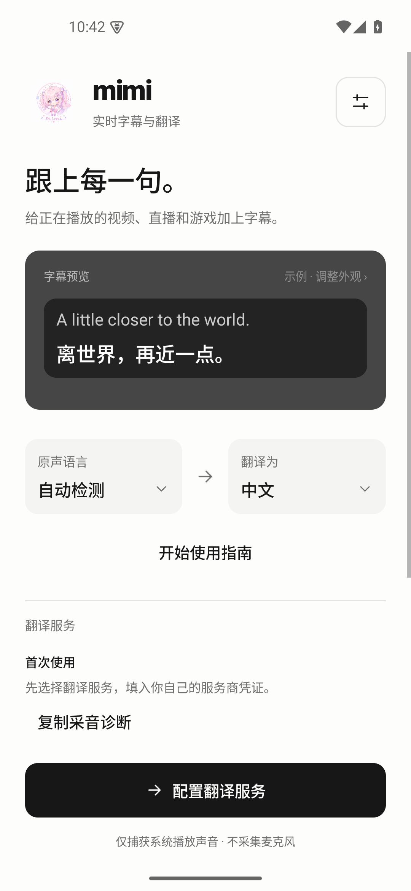
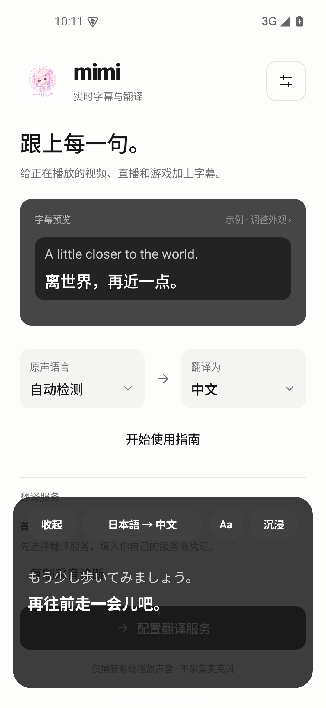
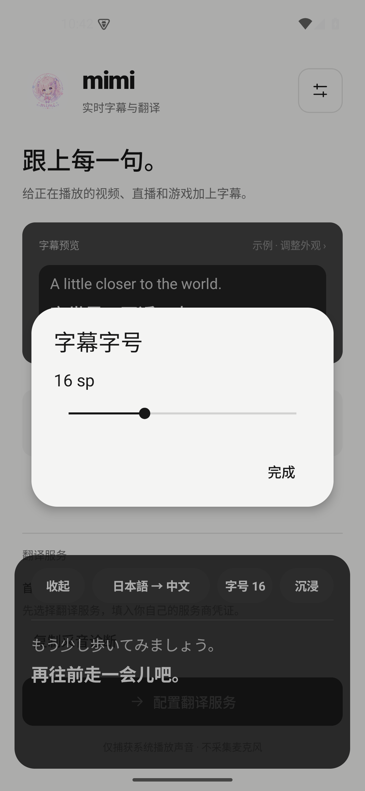
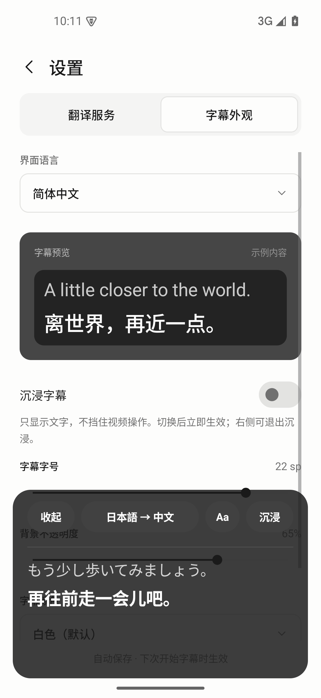
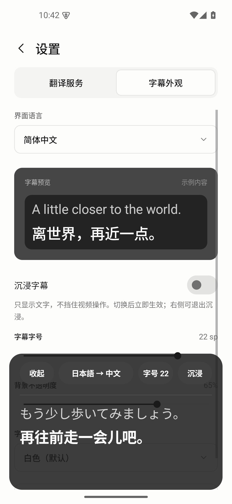

# Android language and overlay Before/After

Native API 35 screenshots use a blank emulator, Simplified Chinese, the same
synthetic Japanese/Chinese subtitle pair, 393dp portrait width and normal system
font size. No credentials, media recording, recognition or translation requests
are involved. The Before build retains the overlay/settings behavior from
`54c14c60` with the seven-language resource patch. After was captured from
`08c1828b`; the subsequent `dab59785` field-hint repair leaves these overlay
scenarios unchanged.

| Scenario | Before | After |
| --- | --- | --- |
| No caption yet | A padded, empty background remains above the start button. | The empty caption window is hidden; capture status can still appear when needed. |
| Font action | Aa silently cycles a preset without showing the chosen value. | A labeled action shows the current size and opens a native slider with live feedback. |
| Settings font slider | Changing the saved size to 22 leaves the existing translation at 21sp. | The same change updates the existing translation to 25sp immediately (22sp source + 3sp translation). |

## Empty initial state

| Before | After |
| --- | --- |
|  |  |

## Font control

| Before | After |
| --- | --- |
|  |  |

## Settings applied to the existing caption

| Before | After |
| --- | --- |
|  |  |

## Language coverage

Android now exposes the desktop language set: 简体中文, 繁體中文, English, 日本語,
Deutsch, 한국어 and Français, plus Follow system. English is the fallback for
unsupported system languages. Locale, translated resources, format placeholders
and protocol tokens are checked against the owning desktop catalog.

API 32 and API 35 native checks cover settings, service editors/help, overlay controls,
restart persistence, 320dp layouts, 200% system fonts and light/dark surfaces.
Large-font settings tabs stack; overlay actions use additional rows when they
cannot fit. Service editors wrap required labels and their save action, and
provider-help links scroll with the content.
UI fixtures establish rendering and interaction behavior. They do not establish
provider translation quality, physical speaker audibility or real-device acceptance.
