# Windows verification record — mimi v1.5.9 (2026-10-04)

This record is a **public evidence copy**: it contains settings-page and installer
screenshots only — no meeting audio, no subtitle text. The application-picker screenshot
is cropped so third-party application names are not published.

## Machine, build and method

| Item | Value |
| --- | --- |
| OS | Windows 11 Home (Chinese) 25H2, `10.0.26200.9457` |
| Scaling | display 150% (`GetDpiForWindow=144`, `GetDpiForMonitor=144`) + Windows text scaling 120% (`HKCU\Software\Microsoft\Accessibility\TextScaleFactor=120`) → WebView2 `devicePixelRatio=1.8`; `visualViewport.scale=1` |
| Portable build | `mimi_1.5.9_x64-portable.zip` SHA256 `8e4e4685445894e58d00df6a6def1a59b0b4dfbcd37f79e81011e6fdbd8c798b` (matches `SHA256SUMS.txt`); extracted `mimi.exe` SHA256 `aa5c6654ac3f7bc4b53973da6d8251478df05ceeb058f0cb5688c254795166bc` |
| Installed build | NSIS per-user install, uninstall entry `1.5.9`, `mimi.exe` SHA256 `ADA67FB0000FB4ABDCEAC5…` → full value `ADA67FB0000FB4ABDCE5A981C7C88273710E6173B40274339A46F70C42F1ACAC`. The installed and portable executables differ in exactly 3 bytes at the Tauri bundle-type placeholder (`…_VAR_NSS` vs `…_VAR_UNK`) |
| Source build for the ignored tests | clean worktree at tag `v1.5.9` = `daf24709dae2c71074ca2e4bb6bf9092caf21915`, `cargo build --tests` exit 0 |
| Driving the UI | settings WebView over CDP (`WEBVIEW2_ADDITIONAL_BROWSER_ARGUMENTS=--remote-debugging-port=9333`), `Runtime.evaluate` / `Page.captureScreenshot` / `CSS.getPlatformFontsForNode`; native window geometry via Win32 `GetClientRect` |

Two modes are used and always labelled:

* **UI-test mode** (`MIMI_UI_TEST=1`, synthetic session state, no credentials, no capture) — layout/font evidence.
* **Normal mode** with the real `%APPDATA%` profile — capture, routing, application list, install/update.

> Reproduction note that cost the most time: `MIMI_UI_TEST_PREFERENCES_DIR` must be a
> directory **under `%TEMP%` whose name starts with `mimi-ui-test-`**
> (`settings_store.rs:847-870`). Any other path makes the app fail in its setup hook with
> `UI-test preferences require a private temporary fixture directory` and exit code
> `0xC0000409`. A one-line note in `docs/development/` would save the next person this.

## 1. Settings layout and CJK font (issue #132)

UI-test mode, real clicks through 通用 → 界面语言 (verified by reading back
`localStorage["mimi-ui-language"]` and `document.documentElement.lang`).

| Viewport | Physical client | Tauri logical | CSS viewport |
| --- | --- | --- | --- |
| narrow (min width) | 780×894 | 520×596 | 434×497 |
| maximized | 3200×1894 | 2133×1263 | 1778×1053 |

| Check (narrow, 434 CSS px) | Raw value |
| --- | --- |
| Adjacent settings-row vertical gaps | zh `23.99 ×8`, en `24/23.99 ×8`, ja `24/23.99 ×8` CSS px |
| `采集应用` ↔ `输出设备` (the two 36 px pickers named in #132) | row gap **16** CSS px (`240.61 → 256.61`), control gap `51.99` px, **not touching**; maximized row gap also 16 |
| Chinese label boxes | `clientWidth == scrollWidth` and `getClientRects().length == 1` for every row (no one-character-per-line wrapping, no overflow) |
| Select controls (`字幕显示 / 状态灯样式 / 采集应用 / 输出设备 / 界面语言`) | `scrollWidth == clientWidth` — no horizontal overflow |

CJK font (`CSS.getPlatformFontsForNode`, 5 Chinese text nodes): every node resolves to a
single platform font — `familyName = "Microsoft YaHei UI"`,
`postScriptName = "MicrosoftYaHeiUI-Bold"`, `isCustomFont = false`. The computed stack keeps
Chinese families ahead of the Japanese fallbacks outside Japanese UI
(`… "PingFang SC", "Microsoft YaHei UI", "Microsoft YaHei", DengXian, SimHei, "Noto Sans CJK SC", "Hiragino Sans", "Yu Gothic UI", "Meiryo" …`;
`:lang(ja)` reverses only that ordering). `C:/Windows/Fonts/msyh.ttc` (19,704,352 B) exists
and both `Microsoft YaHei` and `Microsoft YaHei UI` are registered.

| narrow | maximized |
| --- | --- |
| 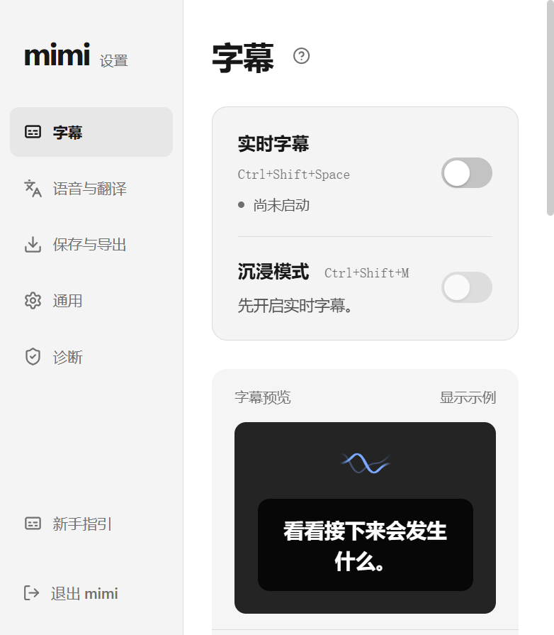 | 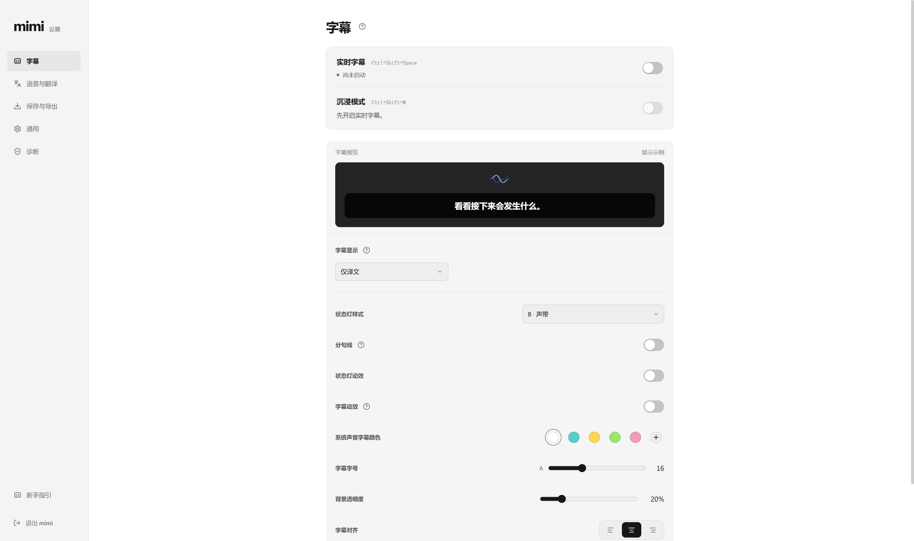 |
| 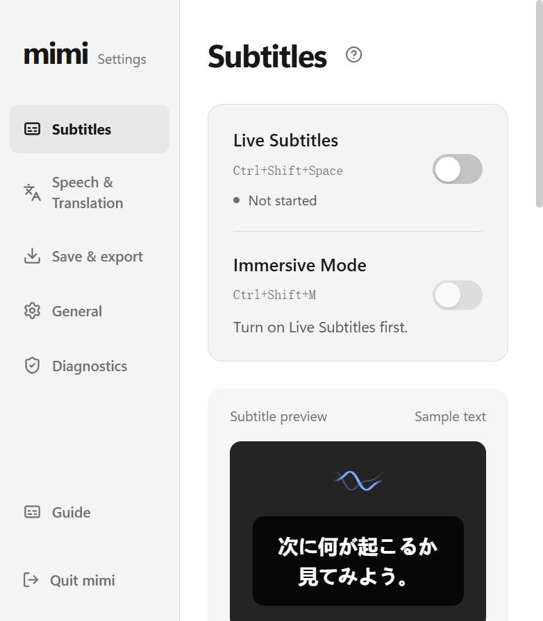 | 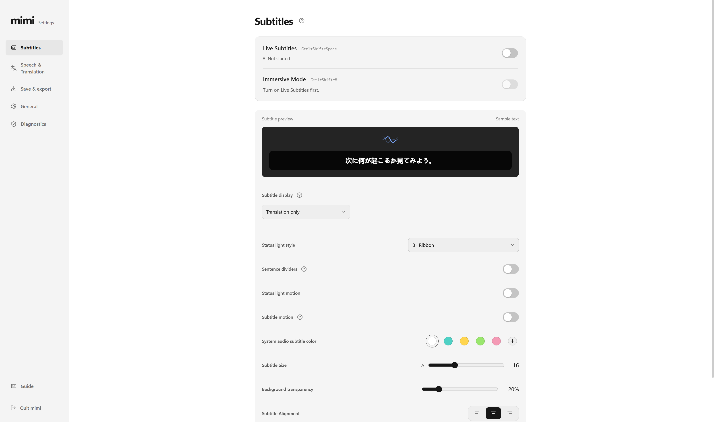 |
| 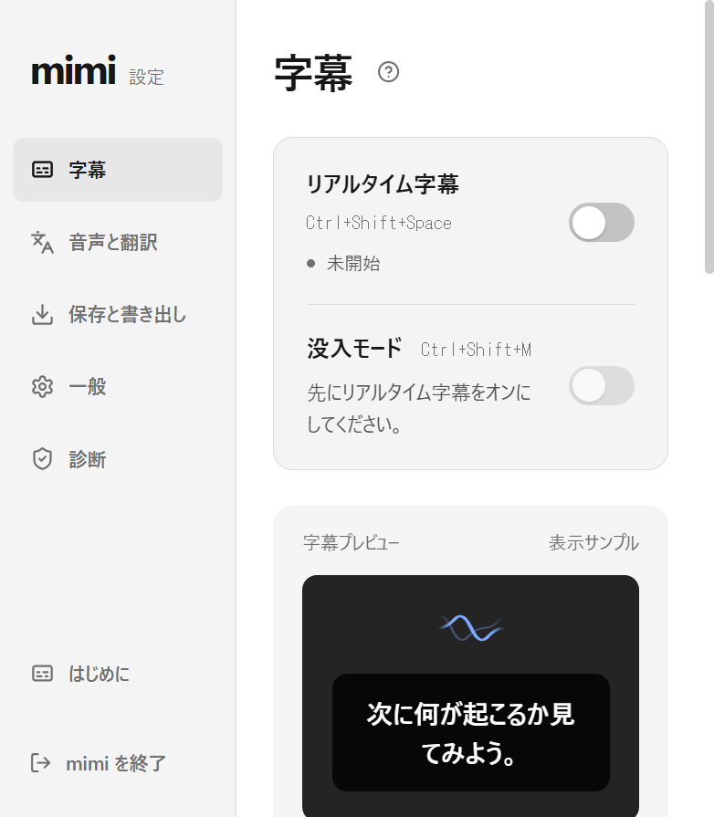 | 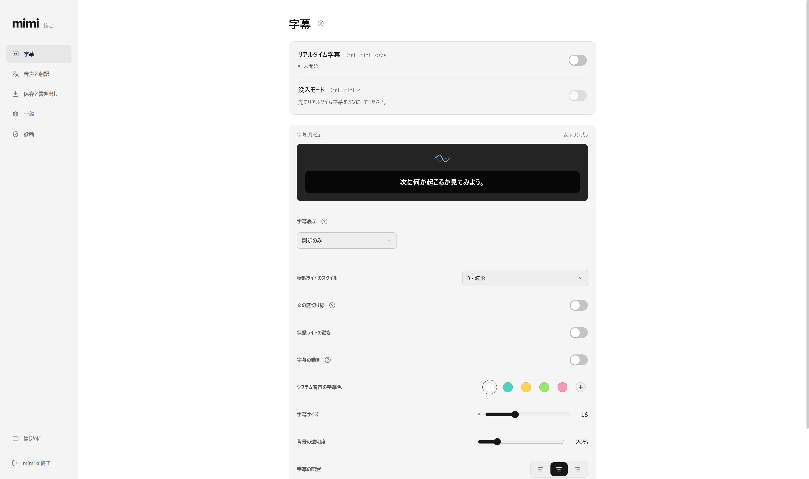 |

**Boundary:** this is Windows 11 build 26200, **not** the reporter's Windows 10 IoT
Enterprise LTSC 21H2 (19044). The font-fallback question on that image still needs a check
there; this record only shows the stack order and the runtime resolution on 26200.

## 2. Capture, device routing and application capture (issues #74 / #78)

### 2.1 The two `#[ignore]`d native tests

Both previously required a real Windows machine with a default playback endpoint and had
never been executed. On this machine, at `daf24709`:

```
cargo test --lib audio::windows::tests::native_default_output_opens_as_a_wasapi_loopback_stream -- --ignored --exact --nocapture
test result: ok. 1 passed; 0 failed; 0 ignored; 0 measured; 1008 filtered out; finished in 0.59s

cargo test --lib clients::qwen_mt_client::tests::public_https_uses_system_certificate_validation -- --ignored --exact --nocapture
test result: ok. 1 passed; 0 failed; 0 ignored; 0 measured; 1008 filtered out; finished in 1.16s
```

### 2.2 Real session (installed 1.5.9, normal mode)

* Device picker enumerated: `跟随系统` / `扬声器 (Realtek(R) Audio)` / `扬声器 (ToDesk Virtual Audio)`.
* During the session `capture_status.actualDeviceName = "扬声器 (Realtek(R) Audio)"`, row text `跟随系统` + `扬声器 (Realtek(R) Audio) · 收到声音`.
* Alibaba session (≈215 s listening, ≈46 s of real speech): `apiLatencyMs 42–52` (n=11), `translationLatencyMs 268–506` (mean 326, `kind=request`); `session_transcript_page` returned 7 entries (text kept locally).
* Stop chain: `listening → stop_requested → stopping → idle`; two `CAPTURE_BACKPRESSURE` events (`category=backlog, code=CAPTURE_BACKPRESSURE, phase=capture`) **self-recovered**, UI `role=alert` stayed empty; the archive after stop was empty (recording off).

### 2.3 Routing scenario from #74 — not reproduced as a failure

Live condition (real meeting, nothing constructed): `Console = Multimedia = 扬声器 (Realtek(R) Audio)`
(peak `0.000000` throughout), **`Communications = 耳机 (Chu2 DSP)`** carrying the meeting audio
(peak `0.0004–0.36`). Windows routing was not modified during the test and the meeting was not
interrupted.

| Point | Output device | `strategy` | `actualDeviceName` | `soundRecent` | Row text | Subtitles |
| --- | --- | --- | --- | --- | --- | --- |
| 1 | 跟随系统 | `follow_system` | **耳机 (Chu2 DSP)** | true | `跟随系统` · `耳机 (Chu2 DSP) · 收到声音` | yes (6 lines) |
| 2 | 跟随系统 + speech played to the default speakers | `follow_system` | 耳机 (Chu2 DSP) (unchanged inside the session) | true | same | yes (8 lines) |
| 3 | 跟随通信设备（通话耳机） | `manual_output` | 耳机 (Chu2 DSP) | true | `跟随通信设备（通话耳机）` · `耳机 (Chu2 DSP) · 收到声音` | yes (6 lines) |

Endpoint peaks during point 1: headset `0.115749 / 0.001451 / 0.171501 / 0.063168`,
Realtek `0 / 0 / 0 / 0`. During point 2: speakers `0.049173 / 0.04459 / 0 / 0.004597 / 0.012152`,
headset `0.355564 / 0.050198 / 0.111099 / 0.000929 / 0.142376`.

So on this build `跟随系统` followed the **audible** endpoint and captioned the meeting while the
system default stayed on the silent speakers. Point 2 staying on the headset is the documented
"device is bound when the session starts" behaviour, recorded here as an observation, not a defect.

| point 1 — 跟随系统 | point 2 — same session, playing to the speakers | point 3 — 跟随通信设备（通话耳机） |
| --- | --- | --- |
| 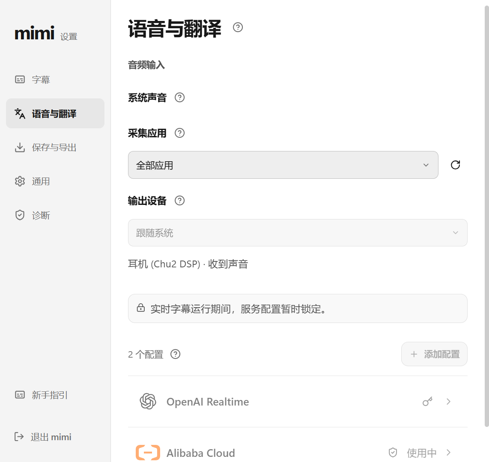 | 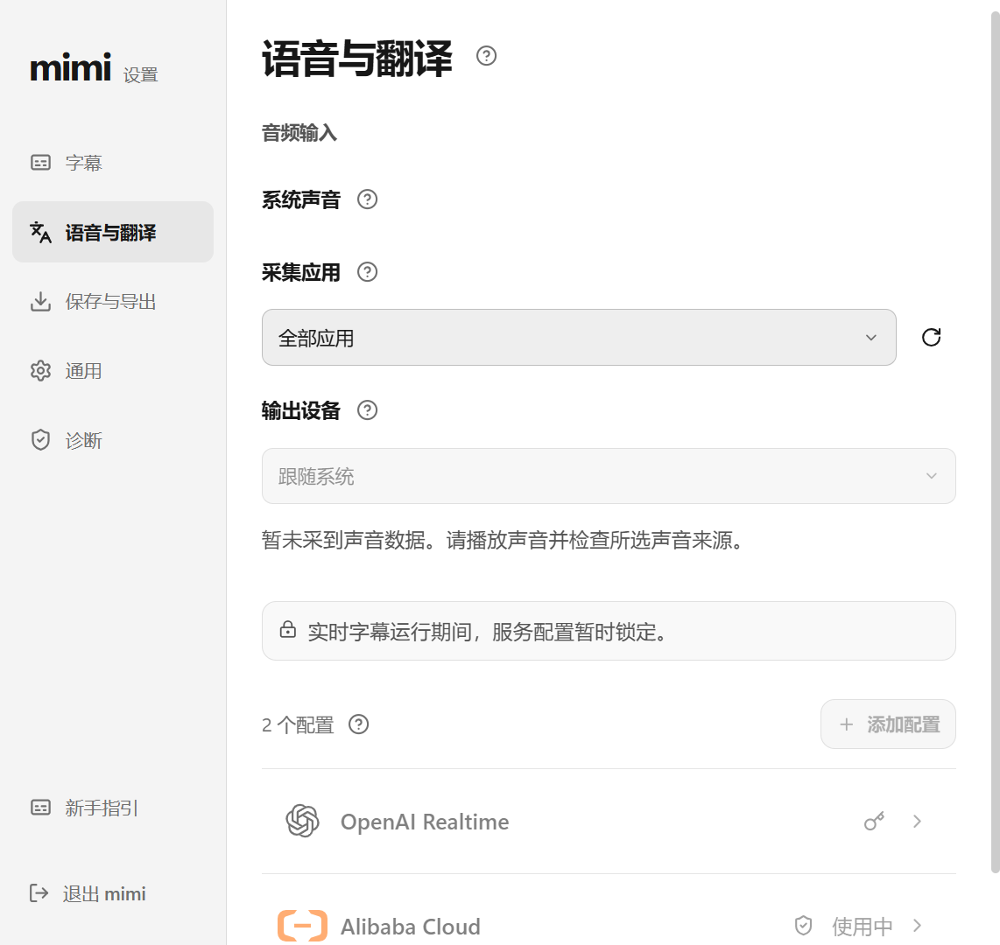 | 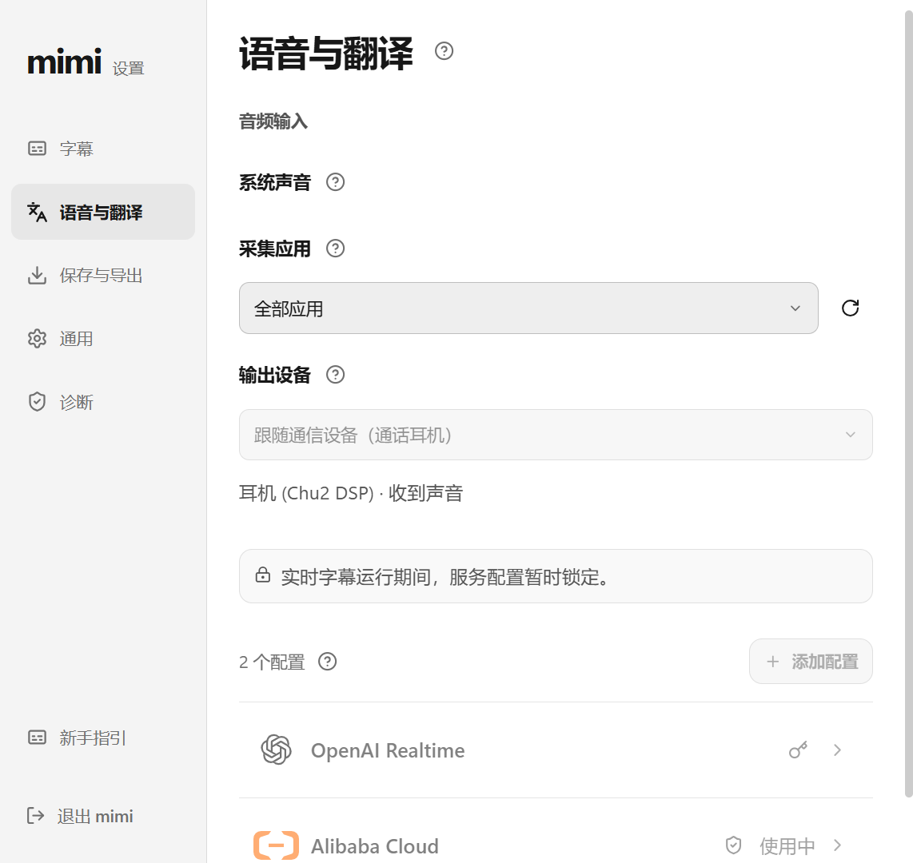 |

### 2.4 Selected-application capture

* build 26200 ≥ 20348 → the `采集应用` picker is present in 语音与翻译.
* In normal mode `audio_applications` returned `supported=true` with **22 real applications**
  (including the meeting application playing at the time); `audio_census` returned the real
  render endpoints plus their audio sessions (PID / process / level / active).
* Missing-target path (constructed in UI-test mode): switching to a non-existent application
  shows `Ghost App · 不可用` plus `所选应用已不可用，请打开应用后重新选择，或选择全部应用。`
* For contrast: in UI-test mode the same command returns a synthetic fixture
  (`commands.rs:1977-1992`), which matters when capturing UI-only evidence.
* **Not verified:** actual per-application isolation (capturing one application while others
  keep playing) — only the picker, the real enumeration and the missing-target path were checked.

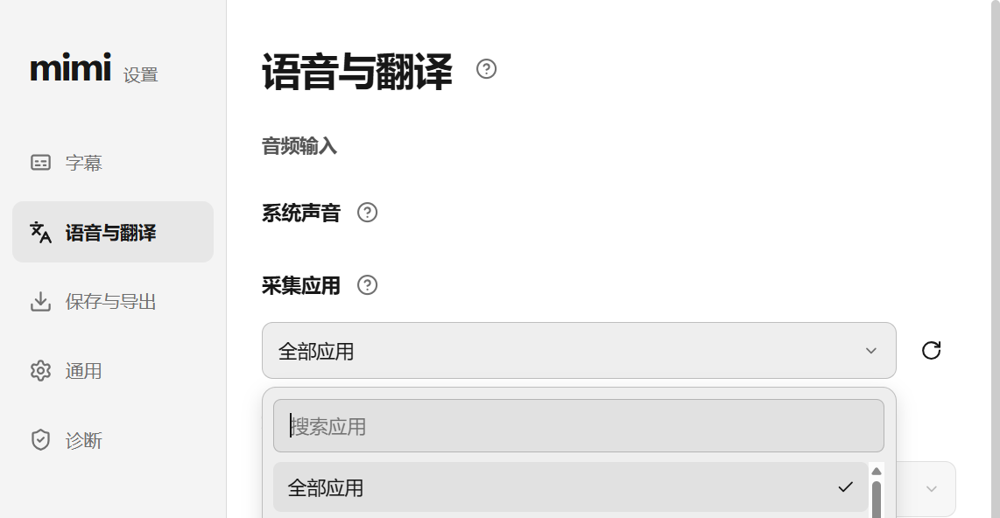

(The picker list is cropped here so third-party application names are not published.)

## 3. Windows install and in-app update

In-app update **1.5.3 → 1.5.9** was performed by the application itself (no silent switches),
driven over CDP on the installed build:

| Stage | On-screen text |
| --- | --- |
| baseline | `版本更新` / `当前版本 v1.5.3` / `检查更新` |
| after 检查更新 | button → `下载更新`; panel `发现新版本 v1.5.9。` + release notes |
| after 下载更新 | button → `安装并重启 Mimi` |
| after install | app exits; installer window `安装 Mimi` (process `mimi-1.5.9-installer`, class `#32770`) appears at +7.34 s in the window watcher |

Post-update verification (independent of the app): uninstall entry `1.5.3` → `1.5.9`;
`C:\Users\Lin\AppData\Local\mimi\mimi.exe` 8,578,560 B `8E074CEC…` → 9,674,752 B `ADA67FB0…F1ACAC`;
`THIRD_PARTY_NOTICES.md` added; Start-menu shortcut intact; `preferences.json` (mtime + SHA256)
and `%APPDATA%\app.yuxino.mimi` (31 files / 160,632,634 B) unchanged.

| baseline | after check | after download | install clicked |
| --- | --- | --- | --- |
| 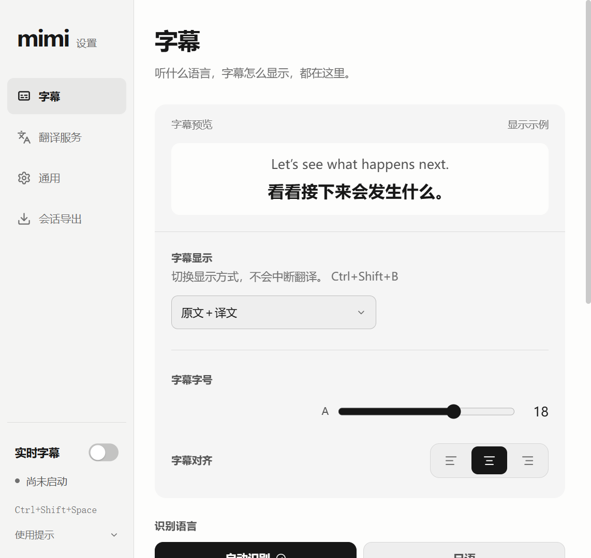 | 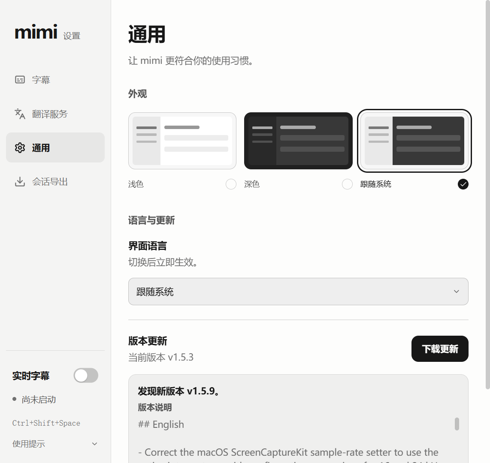 | 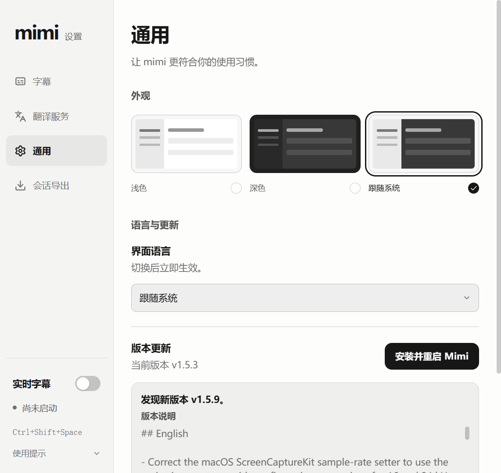 | 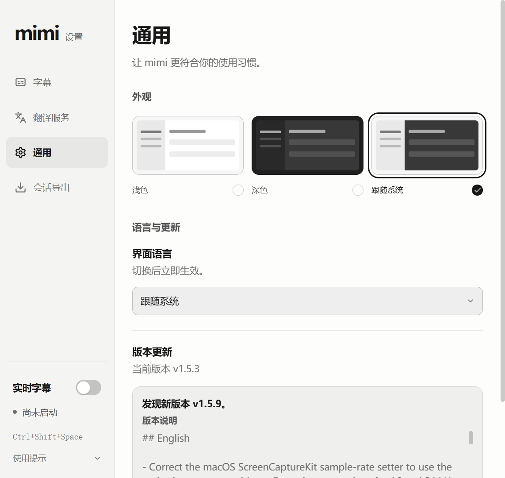 |

MOTW / SmartScreen: a copy of `mimi_1.5.9_x64-setup.exe` was given
`[ZoneTransfer] ZoneId=3` with the real `ReferrerUrl` (210-byte `Zone.Identifier`, SHA256
unchanged) and launched 3× via `CreateProcess` and 1× via `Shell.Application` (ShellExecute).
**No SmartScreen or security warning appeared**; the installer's own window appeared instead
(`motw-installer-window.png` below). Machine fact: `HKLM\SOFTWARE\Policies\Microsoft\Windows\System\EnableSmartScreen = 0`
(`ShellSmartScreenLevel = Warn` is inert while that policy is 0) — so this record does **not**
verify SmartScreen behaviour; the unsigned-installer warning risk needs a machine with default
policy. Packages are unsigned (`Get-AuthenticodeSignature` → `NotSigned`) and were downloaded
without a `Zone.Identifier`.

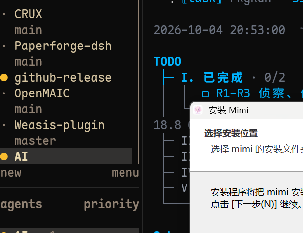

MSI: only static properties were read — `ProductName mimi`, `ProductVersion 1.5.9`,
`ProductCode {D518A90F-79C3-43D7-80A4-201E352F092D}`, `UpgradeCode {9E1B2E2D-EC9D-5A92-BD63-14963529932F}`,
`ALLUSERS=1` (per-machine → elevation on this box: `EnableLUA=1`, `ConsentPromptBehaviorAdmin=5`,
`PromptOnSecureDesktop=1`). **No MSI install/uninstall was performed.**

## 4. Items for maintainer judgement

1. **No-sound hints may be unreachable on a busy endpoint.** With a third-party application
   continuously outputting on the default endpoint (level ≈0.45), playing an all-zero PCM
   signal kept `observation.soundRecent = true` for **46/46 samples**. On such a (very common)
   configuration the `暂未采到声音数据` and `已采到声音数据但当前没有明显声音` texts never appear.
   Expected, or should the criterion change?
2. **`systemOutputDeviceName` is always `null`** under both `follow_system` and `manual_output`,
   while `actualDeviceName` is populated (see `point-*-capture_status.json` in the run).
3. **One unattributed `pause_requested`.** Journal: `start+109948 → listening → pause_requested+169243
   → resume+410618`. No hotkey, click or command corresponded to it, and the journal does not
   record an origin. Reported as raw data, not as a bug conclusion.
4. **Changing the sound source requires stopping the session** — UI text
   `输出设备更换声音来源前，请先停止字幕。` and the command rejects with
   `Listening settings cannot be changed while a session is active.` For meeting/streaming
   users this means subtitles must be interrupted to switch devices; is a smoother path planned?

## 5. Not verified

* Headset unplug/replug, pinned-device disappearance and explicit "selected device unavailable"
  paths (physical operations; not performed).
* The two missing capture-state texts (see 4.1 — the default endpoint was never silent here).
* Per-application capture isolation (see 2.4).
* MSI install/uninstall and uninstaller leftovers; a fresh NSIS install from the downloaded
  setup; update from a version older than 1.3.8.
* SmartScreen behaviour (policy disabled, see 3).
* The reporter's Windows 10 19044 image for #132 (see 1).
* Byte-level updater download events (`Started`/`Progress`/`Finished`) — the CDP socket dropped
  when the app exited for installation; only stage-level text and the window watcher were captured.
